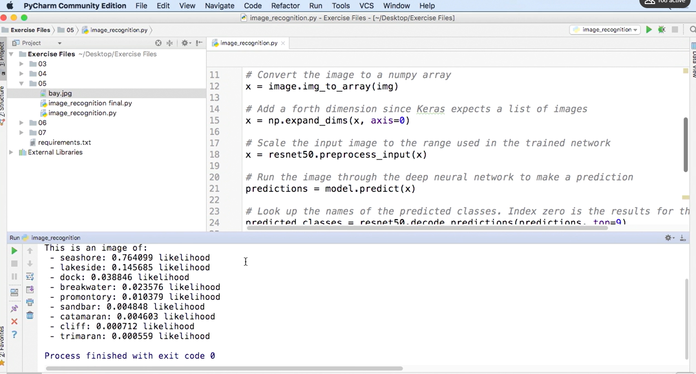

# Keras Neural Network pretrained model (resNet) to Identify Image

This project will explore neural network models using Keras

A. We will predict earnings from an imaginary company given a list of data with the earnings.
B. We will also use pretrained model to identify images.

This project created using Python 3 and will need the following libraries installed:
1. Tensorflow or keras (creating the neural network model)

All the data taken was from the course: 
Building Deep Learning Applications with Keras 2.0 by Adam Geitgey and can be found on this link:
https://www.linkedin.com/learning/building-deep-learning-applications-with-keras-2-0/

# A
1. Load up the pretrained model, resNet.
2. Load up an image.
3. print out prediction.

(Fig.1) Expected output of resNet.
